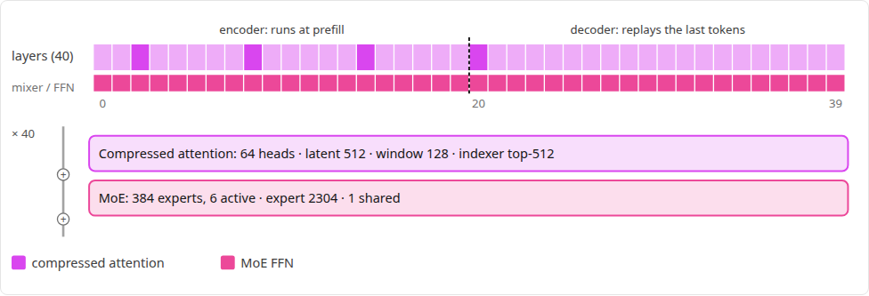
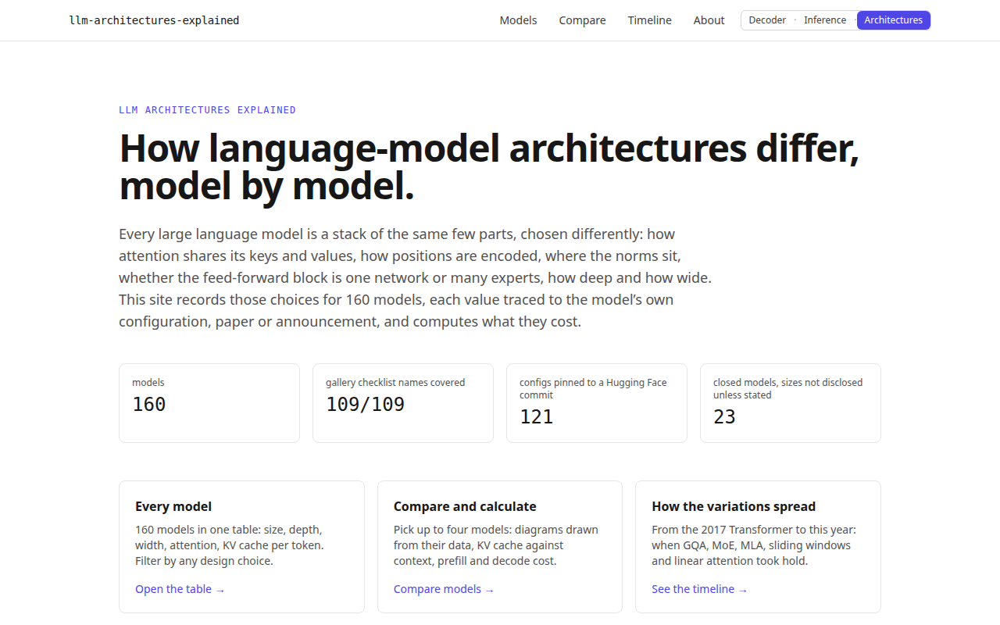
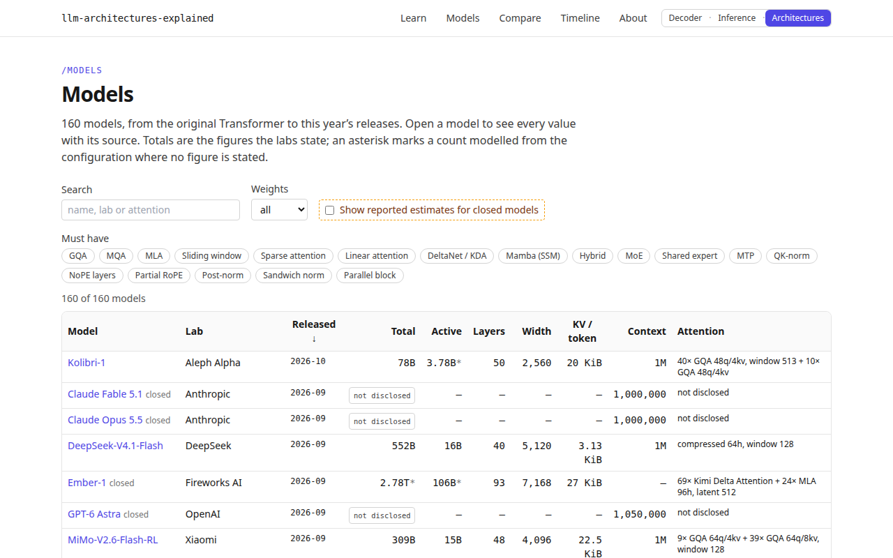
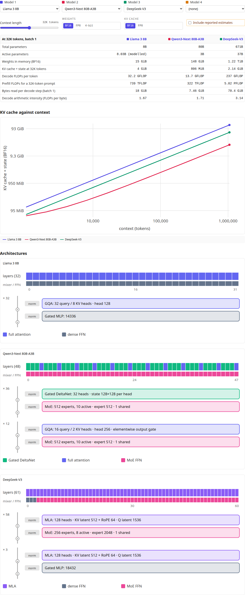
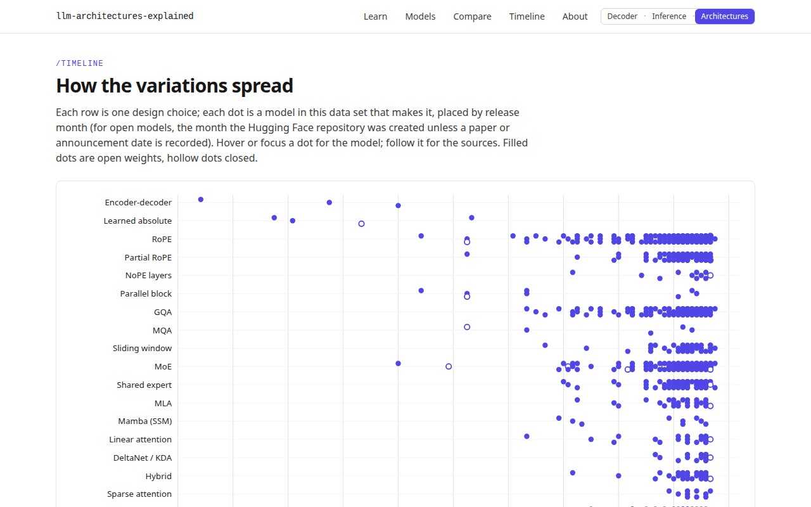
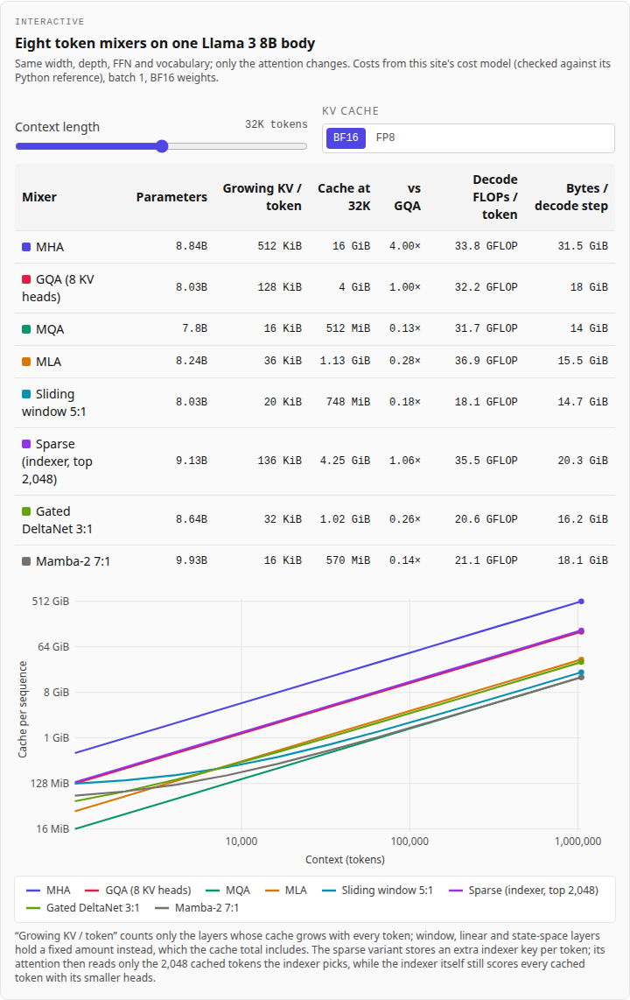
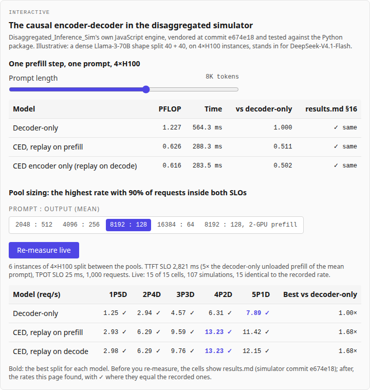

# LLM Architectures Explained

An interactive, sourced record of how large language models are built and
what their designs cost: attention (MHA, GQA, MQA, MLA, sliding windows,
chunked, sparse and compressed attention, linear attention, DeltaNet and
Mamba hybrids), positional encoding, normalisation, dense and mixture-of-experts
feed-forward blocks, depth and width, multi-token prediction, looped and
parallel blocks, encoder-decoders and the causal encoder-decoder. **160
models**, from the 2017 Transformer to this year's releases, every value
traced to the model's own configuration, paper, model card or announcement.

It is the third of a family of companion sites: the
[Transformer Decoder Explainer](https://transformer-decoder-explained.vercel.app/)
shows one forward pass, [LLM Inference Explained](https://llm-inference-explained.vercel.app/)
shows how a model is served, this site shows how the models themselves
differ, and [GPU Kernels Explained](https://gpu-kernels-explained.vercel.app/)
shows how a GPU executes them. They share one design system and link to
each other from the header, in two groups:
"LLM systems" (Decoder · Inference · Architectures · Kernels · Numerics ·
Silicon · Trade-offs) and "Agents", which starts with
[Agent Harnesses Explained](https://agent-harnesses-explained.vercel.app/)
(the loop, tools, context and permissions that turn a model into an agent;
then [Agent Protocols Explained](https://agent-protocols-explained.vercel.app/),
MCP and A2A on the wire; four more agent sites are marked "soon"). [Numerics Explained](https://numerics-explained.vercel.app/)
covers number formats and quantisation, and
[Systolic Arrays Explained](https://systolic-arrays-explained.vercel.app/)
the matrix hardware that runs the models' GEMMs;
[Inference Trade-offs Explained](https://inference-tradeoffs-explained.vercel.app/)
measures serving levers such as MoE expert parallelism, speculative
decoding with an MTP head and encoder-only (CED) prefill.

**Live:** [llm-architectures-explained.vercel.app](https://llm-architectures-explained.vercel.app/)



## Part of

This project sits in the [LLMs](https://github.com/BrendanJamesLynskey/LLMs)
hub, next to the
[Transformer Decoder Explainer](https://github.com/BrendanJamesLynskey/transformer-explainer),
[LLM Inference Explained](https://github.com/BrendanJamesLynskey/llm-inference-explained),
the [Modern Architectures](https://brendanjameslynskey.github.io/LLM_Hub_Modern_Architectures/)
slide series and the
[LLM Inference Simulators](https://brendanjameslynskey.github.io/LLM_Hub_Inference_Simulators/).

## What you can do

| Page           | What it shows                                                                                                                                                                                                                           |
| -------------- | --------------------------------------------------------------------------------------------------------------------------------------------------------------------------------------------------------------------------------------- |
| `/learn`       | Nine chapters, one per axis of variation (attention, positions, norms, MoE, depth and width, long context, MTP, looped and parallel blocks, encoder-decoder and CED), each with a live interactive and the models that use the feature. |
| `/models`      | Every model: total and active parameters, layers, width, attention, KV cache per token, context. Filter by any design choice; sort any column.                                                                                          |
| `/models/[id]` | One model: every value with a status chip and a link to the exact source; a diagram of its layer stack and blocks, generated from the data; its modelled costs; KV cache against context.                                               |
| `/compare`     | Two to four models side by side, with a calculator: context length, weight and KV precision; weights and KV memory, prefill and decode FLOPs, bytes per decode step.                                                                    |
| `/timeline`    | When each variation appears across the data set.                                                                                                                                                                                        |
| `/about`       | Where every value comes from, how estimates are handled, the cost model's conventions and how it is checked.                                                                                                                            |

## Screenshots

|                                                                                   |                                                                               |
| --------------------------------------------------------------------------------- | ----------------------------------------------------------------------------- |
|                                        |                                 |
|                                        |                                  |
|  |  |

Regenerate them with `pnpm build && pnpm start` in one shell and
`pnpm screenshots` in another.

## Where the data comes from

- **One file per model**, [`data/models/<id>.yaml`](data/models/), validated
  in CI against a [JSON Schema](data/schema/model.schema.json). Every value is
  a field `{v, st, src, ref}`: the value, its status, the source it comes from
  and where in that source.
- **Statuses.** `config`: read from `config.json` at a pinned Hugging Face
  commit (the snapshots are in [`data/hf/`](data/hf/), and a test re-reads
  every such value from them). `disclosed`: stated by the lab (model card at
  the same commit, GitHub, docs, announcement). `paper`: from the paper, by
  section or table; every arXiv id is checked at export.arxiv.org
  ([`data/sources/arxiv.json`](data/sources/arxiv.json)). `code`: a rule from
  the modelling code (transformers 5.18.0, or the repository's own file).
  `not-disclosed`: nothing credible is published.
- **Gated configs** (Meta, Google, Cohere, Cisco and others) are transcribed
  from the lab's own GitHub (`llama-models`, `gemma`, `grok-1`) or from the
  paper into [`data/transcribed/`](data/transcribed/), with the line or table
  for every value. Where the owner has accepted a gated licence, the
  [Freshness workflow](.github/workflows/freshness.yml) pins the real
  `config.json` instead, with the `HF_TOKEN` repository secret, and uploads
  the snapshot as an artifact to commit (Llama 4 Maverick is pinned this way):
  `gh workflow run freshness.yml -f pin="org/repo"`, then
  `gh run download <run id> -n pinned-configs -D data/hf`. The token never
  leaves GitHub.
- **Generated, not typed.** [`scripts/build_models.py`](scripts/build_models.py)
  builds the model files from the snapshots, the transcriptions and the
  curation ([`data/curation/`](data/curation/): names, labs, the totals the
  authors state and their sources). [`scripts/hf_adapter.py`](scripts/hf_adapter.py)
  reads each `config.json` family into one normalised form. CI fails if the
  committed files differ from a rebuild.
- **Closed models and reported estimates.** Closed models are listed with
  what their labs disclose. Third-party size estimates appear only as
  _reported estimates_, never as facts: each with its source, date and the
  confidence its source gives, styled distinctly, and kept out of the
  calculator unless the reader switches them on. The site says "not
  disclosed" where nothing credible exists.
- **The gallery checklist.** Sebastian Raschka's
  [LLM Architecture Gallery](https://sebastianraschka.com/llm-architecture-gallery/)
  is used only as a checklist of names
  ([`data/coverage/gallery_2026-10-05.txt`](data/coverage/gallery_2026-10-05.txt))
  and cited as related reading. Nothing else is taken from it: every diagram
  is generated from this data. [`scripts/coverage.py`](scripts/coverage.py)
  checks in CI that all 109 names map to a model here.

## The cost model

[`reference/arch_model.py`](reference/arch_model.py) computes, for any
model with published dimensions, parameter counts (total, active, without
embeddings), KV-cache and recurrent-state bytes for every attention type,
prefill and decode FLOPs (including the causal encoder-decoder, whose
prefill runs only the encoder half plus a bounded replay), and the bytes a
decode step reads. Every closed form has a unit test
([`tests/python/test_arch_model.py`](tests/python/test_arch_model.py)), and
the modelled parameter counts are checked against the totals the authors
state and against the parameter counts of the published weights.

[`src/lib/arch/costModel.ts`](src/lib/arch/costModel.ts) is a line-by-line
TypeScript port. [`scripts/make_fixtures.py`](scripts/make_fixtures.py)
writes the reference's results for every model at eight context lengths and
three precisions, and [`tests/unit/costModel.test.ts`](tests/unit/costModel.test.ts)
requires the port to reproduce every one of them **exactly** (no
tolerance: the same expressions in the same order on IEEE doubles).

Approximated parts are named on the about page and in the tests:
compressed convolutional attention (ZAYA1), Kimi Delta Attention's gate
projections, n-gram embedding tables, GDLA (Motif) and the weights of
multi-token-prediction layers. Multimodal models are modelled as their
text stack.

## The chapters and the live simulator

The nine chapters in [`content/chapters/`](content/chapters/) are MDX with
Concept / Maths / Code layers, as on the companion sites. Each has an
interactive driven by the cost model, or by a closed form in
[`reference/chapter_model.py`](reference/chapter_model.py) (the attention
variants on one body, RoPE wavelengths, the norm-placement variance
argument, MoE and depth/width builders, the MTP speed-up, looping). The
TypeScript port, [`src/lib/chapters/model.ts`](src/lib/chapters/model.ts),
is checked against fixtures from
[`scripts/make_chapter_fixtures.py`](scripts/make_chapter_fixtures.py)
(exactly, except RoPE's `pow`, to 1e-12), and
[`tests/unit/chapters/numbers.test.ts`](tests/unit/chapters/numbers.test.ts)
recomputes every number the prose quotes and checks the MDX still says it.
Code shown in a chapter must be cut from the file it names
([`content.test.ts`](tests/unit/chapters/content.test.ts)).

The encoder-decoder chapter runs
[Disaggregated_Inference_Sim](https://github.com/BrendanJamesLynskey/Disaggregated_Inference_Sim)'s
own JavaScript engine, vendored byte for byte at commit `e674e18` (the
one that added the causal encoder-decoder option) by
`pnpm vendor:sim <commit>`, which records the repository, commit and
SHA-256 in [`src/lib/disagg/vendor/VENDORED.json`](src/lib/disagg/vendor/VENDORED.json).
[`scripts/disagg_reference.py`](scripts/disagg_reference.py), run with the
simulator's virtualenv at that commit, writes the parity fixtures (the
simulator's own ten CED configurations, every request's timestamps and
every instance's energy), the recorded `results.md` sections 16–18, and
the four workloads as unit-rate exponential draws, so the browser rebuilds
Python's arrivals at any rate bit for bit. The chapter reruns the
simulator's capacity search (a port of `search.py`) in a Web Worker; the
unit tests rerun all 72 bisections and require every rate to equal the
recorded one exactly. The simulated numbers are for a dense
Llama-3-70B-shaped proxy split 40 + 40: illustrative, not any lab's model.

## Stack

The same stack as the companion sites, minus the backend:

- **Framework**: Next.js 14 (App Router) + TypeScript (strict)
- **Styling**: Tailwind CSS, Tailwind plugin for ESLint + Prettier
- **Data**: YAML + JSON Schema, built by Python scripts, bundled to JSON
- **Content**: MDX via `next-mdx-remote`, KaTeX rendered on the server
- **Visualisation**: plain SVG generated from the data (block diagrams,
  log-log charts, the timeline), rendered on the server where it can be
- **Testing**: pytest (schema, provenance, sources, the reference model),
  Vitest (exact parity, features, formatting; 100% line coverage on
  `src/lib/arch/`), Playwright (e2e at 1280 and 390 px, light and dark, with
  axe-core scans in both)
- **CI / deploy**: GitHub Actions (data, lint, typecheck, unit, e2e,
  Lighthouse), a weekly freshness workflow, Vercel

No database and no sign-in: every page is statically rendered. The compare
tool and the chapter interactives are code-split; those that use real
models load the compact data file `/data/specs.json` when they open, and
the simulator runs in a Web Worker.

### Design system: where each piece came from

Copied from [llm-inference-explained](https://github.com/BrendanJamesLynskey/llm-inference-explained)
at commit `ff7d3bd`, which copied it from the explainer:

| Here                                                                                                                                               | From                                                          |
| -------------------------------------------------------------------------------------------------------------------------------------------------- | ------------------------------------------------------------- |
| `tailwind.config.ts`, `src/app/globals.css`, `src/app/layout.tsx`                                                                                  | identical apart from titles                                   |
| `src/components/ui/SiteHeader.tsx`                                                                                                                 | the same header; new navigation links                         |
| `src/components/ui/SiteSwitch.tsx`                                                                                                                 | the same component on all three sites; only `current` differs |
| `src/app/learn/`, `src/lib/mdx/`, `Layer.tsx`, `LayerToggle.tsx`, `MdxTable.tsx`, `scripts/vendor-sim-engine.ts`                                   | copied from llm-inference-explained (`ff7d3bd`)               |
| `src/components/ui/Controls.tsx`, `WidgetFrame.tsx`, `Callout.tsx`                                                                                 | unchanged                                                     |
| `.eslintrc.json`, `.prettierrc.json`, `tsconfig.json`, `vitest.config.ts`, `playwright.config.ts`, `lighthouserc.json`, `.github/workflows/ci.yml` | adapted (data job, new pages)                                 |
| `scripts/smoke-check.ts`, `scripts/capture-screenshots.ts`, `RUNBOOK.md`                                                                           | adapted                                                       |

A shared npm package for the design system would be cleaner in principle;
for three small sites, copying and recording the origin stays simpler.

## Local development

- Node ≥ 20.11 and pnpm ≥ 9 (pinned via `packageManager`); Python ≥ 3.10.
- No environment variables, no database.

```bash
git clone https://github.com/BrendanJamesLynskey/llm-architectures-explained
cd llm-architectures-explained
pnpm install
python3 -m venv .venv && .venv/bin/pip install -r reference/requirements.txt
pnpm dev                              # http://localhost:3000
```

## Changing the data

```bash
.venv/bin/python scripts/fetch_configs.py --pin org/repo   # pin a new model's config
# edit data/curation/*.yaml (name, lab, stated totals and their sources)
.venv/bin/python scripts/build_models.py                   # regenerate data/models, src/data, public/data
.venv/bin/python scripts/make_fixtures.py                  # regenerate the parity fixtures
.venv/bin/python scripts/make_chapter_fixtures.py          # regenerate the chapters' data and fixtures
.venv/bin/python scripts/verify_arxiv.py                   # if a new paper is cited (network)
.venv/bin/python -m pytest tests/python && pnpm test
```

## Testing

```bash
.venv/bin/python -m pytest tests/python   # schema, provenance, sources, reference model
python3 scripts/coverage.py               # gallery coverage report
pnpm lint && pnpm typecheck && pnpm format:check
pnpm test:coverage                        # Vitest with thresholds (exact parity included)
pnpm test:e2e                             # Playwright on a production build (builds first)
pnpm lighthouse                           # Lighthouse CI on a `pnpm build`
pnpm smoke <url>                          # post-deploy check of every page
```

Re-vendoring the simulator (only when a newer commit should be shown):

```bash
pnpm vendor:sim <commit>                  # copies web/sim_engine.js from ../Disaggregated_Inference_Sim
git -C ../Disaggregated_Inference_Sim checkout <commit>
pnpm ced:reference                        # parity fixtures, results.md 16–18, workloads (sim's .venv)
pnpm test                                 # parity, the 72 bisections, the chapters' numbers
```

## Deploying

See [`RUNBOOK.md`](RUNBOOK.md): a CLI deploy from a clean `git archive`
export, then `pnpm smoke`.

## Project layout

```
data/models/          One generated YAML file per model (committed)
data/hf/              Pinned config.json snapshots and Hugging Face metadata
data/transcribed/     Configs transcribed from labs' GitHub repositories or papers
data/curation/        Names, labs, stated totals, papers, estimates
data/coverage/        The gallery checklist (names only)
data/schema/          JSON Schema for a model file
data/sources/         arXiv verification record (data and chapters)
content/chapters/     The nine MDX chapters
reference/            The Python cost model and the chapters' closed forms
scripts/              build_models, hf_adapter, arch_facts, make_fixtures, coverage,
                      fetch_configs, verify_arxiv, smoke-check, capture-screenshots
src/app/              Routes: /, /learn, /learn/[slug], /models, /models/[id], /compare,
                      /timeline, /about
src/lib/arch/         The TypeScript cost model, features, formatting, table rows
src/lib/chapters/     The chapters' builders and closed forms (port of chapter_model.py)
src/lib/disagg/       The vendored simulator engine, its wrapper and the CED experiment
public/disagg/        Recorded CED results and workloads (scripts/disagg_reference.py)
src/components/       Header, cross-site switch, provenance chips, diagrams, charts,
                      the model table and the compare tool
tests/python/         pytest
tests/unit/           Vitest (fixtures in tests/fixtures/ and tests/unit/fixtures/)
tests/e2e/            Playwright + axe-core
```

## References

Every model page lists its own sources. The papers behind the landmark
models include Vaswani et al., 2017 — _[Attention Is All You Need](https://arxiv.org/abs/1706.03762)_;
Brown et al., 2020 — _[Language Models are Few-Shot Learners](https://arxiv.org/abs/2005.14165)_;
Fedus et al., 2021 — _[Switch Transformers](https://arxiv.org/abs/2101.03961)_;
Du et al., 2021 — _[GLaM](https://arxiv.org/abs/2112.06905)_;
Chowdhery et al., 2022 — _[PaLM](https://arxiv.org/abs/2204.02311)_;
Gu and Dao, 2023 — _[Mamba](https://arxiv.org/abs/2312.00752)_;
DeepSeek-AI, 2024 — _[DeepSeek-V2](https://arxiv.org/abs/2405.04434)_ (MLA);
DeepSeek-AI, 2026 — _[DeepSeek-V4.1-Flash](https://arxiv.org/abs/2609.19969)_ (causal encoder-decoder).

## Contributing

PRs welcome. CI runs the data checks and the Python tests, `format:check`,
`lint`, `typecheck`, unit tests with coverage thresholds, e2e on a
production build, and Lighthouse CI (performance, accessibility and best
practices must each score at least 90 on `/`, `/models`, `/compare`,
`/models/deepseek-v3` and `/timeline`).

## Licence

MIT — see [`LICENSE`](LICENSE). The pinned configuration snapshots in
`data/hf/` are copies of each model's published `config.json`, kept for
provenance; they remain under their models' licences.
